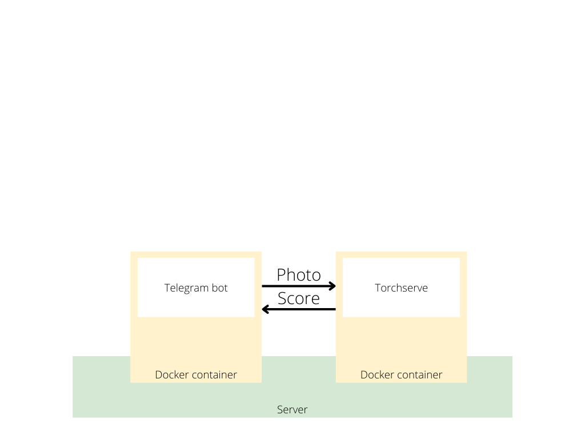

### Date matching

In this project i build app that choosing girls based on my taste. **Just for educational purposes.**

At this moment this is an irreproducible project

<!-- <br> -->

### Architecture
<br>


### Usage

intsall [torchserve image](https://github.com/pytorch/serve/tree/master/docker)

1. build the image
    ```
    $ docker build -t predict_and_burn .
    ```

2. run
    ```
    $ docker run --rm --name beauty_recognition -v <host_dir>:/usr/src/app/Torchserve
    predict_and_burn 
    ```

### Notes: 
1. Currently just parse Torchserve folder predict and wire scores in score.txt

Project_dir
└──Torchserve
   ├── predict.py
   ├── Score.txt
   └──...

2. You can  build your own model.
Just put the data in the right folders ( [see this](Train/README.md) ) and run train script

Project_dir
└──Train
   ├──train.py
   └──...

### Todo

* [ ] Torchserve
  * [ ] Write serve handler
  * [ ] Deploy model on torchserve container
* [ ] Telegram part
  * [ ] Implement predict command
  * [ ] Deploy telegram user bot on container
* [ ] Update readme and **usage** 
* [ ] Improve train pipeline
* [ ] Improve parse pipeline
* [ ] Reproducible
